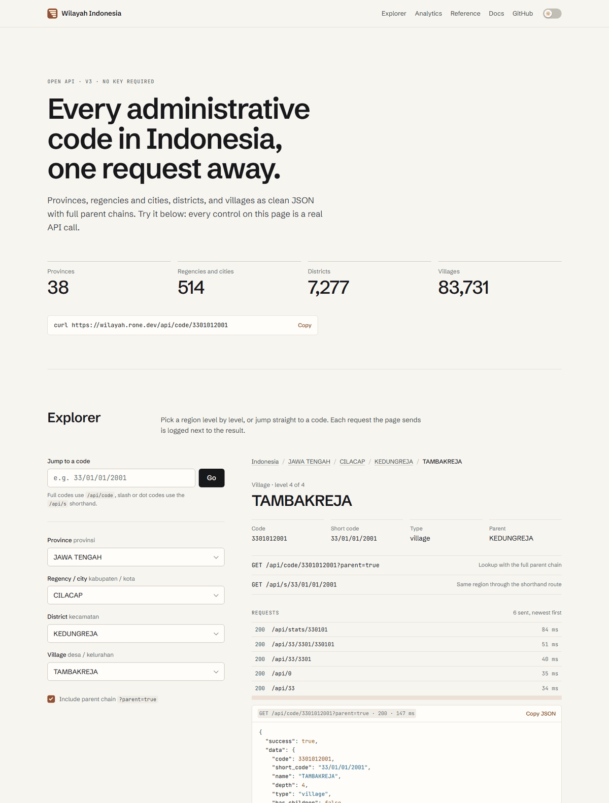
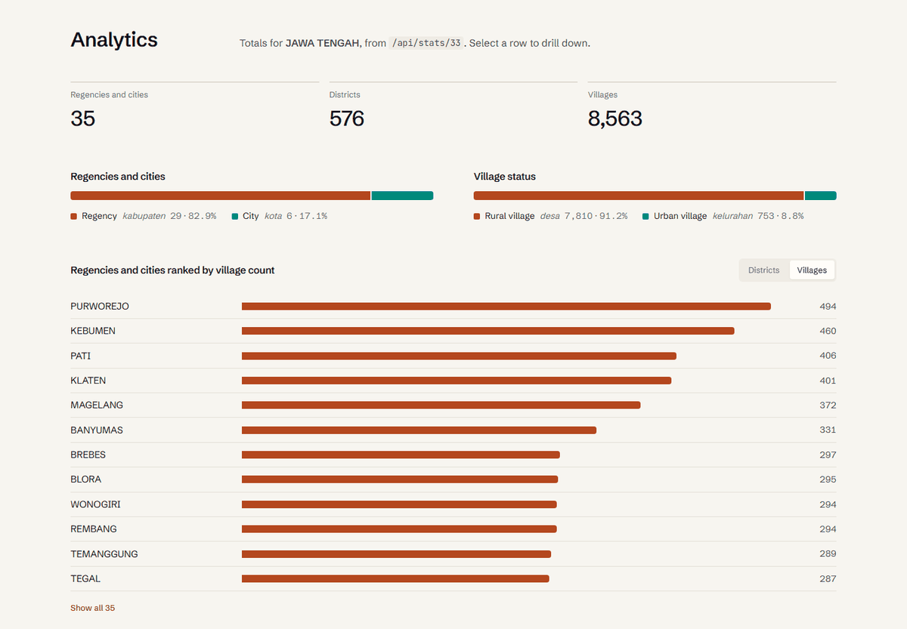

# Wilayah Indonesia API

Free JSON API for Indonesian administrative region codes: 38 provinces, 514 regencies and cities,
7,277 districts and 83,731 villages, each with its full parent chain. No API key.

- Live demo: <https://wilayah.rone.dev>
- Swagger UI: <https://wilayah.rone.dev/docs>
- Error codes: <https://wilayah.rone.dev/docs/errors>
- Hosted API terms: [HOSTED_API_TERMS.md](HOSTED_API_TERMS.md)

```bash
curl https://wilayah.rone.dev/api/code/3301012001
```



## The demo site

The landing page at `/` is a working client for the API, not a brochure:

- **Explorer**: four cascading pickers (province → regency or city → district → village)
  with type-to-filter, full keyboard support and shareable `?code=` deep links.
- **Jump to a code**: accepts full codes (`3301012001`) or shorthand (`33/01/01/2001`, `33.1.1.2001`)
  and shows the API's own error envelope when the code is wrong.
- **Request log**: every call the page makes is listed with status and timing; select one to read its JSON.
- **Analytics**: totals, regency/city and village-status splits, and a ranking of child regions for
  whatever is selected, all from `GET /api/stats/{code}`. Select a row to drill down.
- **Reference**: generated from the registered routes, so it cannot drift from the API.



It is server-rendered with Jinja2 and uses one hand-written stylesheet and two small scripts.
There is no build step and no frontend dependency. Light theme by default, with a switch for dark
that remembers your choice. Everything is in English, with the official Indonesian term shown
beside each level (province, *provinsi*).

Icons are generated from one definition: `uv run --with pillow python scripts/build_icons.py`.

## Endpoints

All endpoints are `GET`.

| Path | Returns |
| --- | --- |
| `/api/` | API index: version, docs links, endpoints grouped by tag |
| `/api/health` | Health check |
| `/api/0` | All provinces |
| `/api/{province_code}` | Regencies and cities in a province, e.g. `/api/33` |
| `/api/{province_code}/{regency_code}` | Districts in a regency, e.g. `/api/33/3301` |
| `/api/{province_code}/{regency_code}/{district_code}` | Villages in a district, e.g. `/api/33/3301/330101` |
| `/api/code/{code}` | Any region by full code (2, 4, 6 or 10 digits) |
| `/api/s/{province_code}/{regency_number}/{district_number}/{village_number}` | Shorthand lookup, 1 to 4 segments, e.g. `/api/s/33/1/1/2001` |
| `/api/stats/{code}` | Descendant totals for a region and each direct child; `0` means Indonesia |

`/api/kode/{code}`, the previous name of the lookup route, still works but is deprecated and
hidden from the docs. Use `/api/code/{code}`.

Query parameter `parent`:

- Lookups (`/api/code`, `/api/s`) default to `parent=true` and return the full chain up to the province.
- Lists default to `parent=false`; `parent=true` adds each item's direct parent only.

Other routes: `/` (demo), `/docs/errors` (error catalog), `/docs`, `/redoc`, `/openapi.json`,
`/robots.txt`, `/sitemap.xml`.

## Codes and kinds

Full codes grow by level: `33` → `3301` → `330101` → `3301012001`. `short_code` splits them as
`33/01/01/2001`.

`/api/stats` also counts regions by kind (`data.kinds`), following the official code convention
rather than names:

| Key | Official term | Rule |
| --- | --- | --- |
| `regency` | kabupaten | regency segment `01`–`70` (`KOTAWARINGIN BARAT` is a regency) |
| `city` | kota | regency segment `71`–`99` |
| `urban_village` | kelurahan | village segment starts with `1` |
| `rural_village` | desa | village segment starts with `2` |
| `customary_village` | desa adat | village segment starts with `3` |

`regency + city` equals `levels.regency`; the three village kinds sum to `levels.village`.

## Response envelope

Every response, success or error, has the same shape:

```json
{
  "success": true,
  "data": {
    "code": 330101,
    "short_code": "33/01/01",
    "name": "KEDUNGREJA",
    "depth": 3,
    "type": "district",
    "has_children": true,
    "parent": {
      "code": 3301,
      "short_code": "33/01",
      "name": "CILACAP",
      "depth": 2,
      "type": "regency",
      "parent": { "code": 33, "short_code": "33", "name": "JAWA TENGAH", "depth": 1, "type": "province", "parent": null }
    }
  },
  "error": null,
  "meta": { "api_version": "v3", "timestamp": "2026-04-08T04:30:00Z", "request_id": "…", "duration_ms": 3 }
}
```

Lists put their items in `data.items` with a `data.pagination` block (lists are always complete).
Stats return `data.levels`, `data.kinds` and `data.children`.

Errors set `success` to `false` and fill `error`:

```json
{
  "code": "INVALID_REGION_CODE",
  "message": "The region code format is invalid.",
  "detail": "Parameter code must use one of the supported code lengths: 2 (province), 4 (regency), 6 (district), or 10 (village).",
  "hint": "Use 2 digits for a province, 4 for a regency, 6 for a district, or 10 for a village.",
  "docs": "https://wilayah.rone.dev/docs/errors#INVALID_REGION_CODE",
  "fields": [{ "field": "code", "value": 123, "rule": "digits:2|4|6|10", "message": "code must be 2, 4, 6, or 10 digits." }]
}
```

Branch on `error.code`; the full list is at [`/docs/errors`](https://wilayah.rone.dev/docs/errors).

## Run locally

Requires Python 3.12+ and [uv](https://docs.astral.sh/uv/).

```bash
uv sync
uv run fastapi dev app/main.py
```

Then open <http://127.0.0.1:8000/>. On Windows consoles that cannot print emoji, run
`uv run uvicorn app.main:app --reload` instead. `.claude/launch.json` holds the same command for
the Claude Code preview browser.

The screenshots in `docs/` are 1440px-wide renders of the running site, resized to 1200px.

Settings come from environment variables or `.env`:

| Variable | Default | Purpose |
| --- | --- | --- |
| `SITE_URL` | `https://wilayah.rone.dev` | Canonical URL for SEO tags, `robots.txt` and `sitemap.xml` |
| `ALLOWED_ORIGINS` | empty | Comma-separated CORS origins; CORS is off when empty |
| `DEBUG` | `false` | FastAPI debug mode |

## Tests

```bash
uv run --group dev pytest tests -q
```

## Data

The dataset lives in [`data/`](data) as four JSON files. If you need all of it, take the files
instead of crawling the API. The data is a snapshot of the official register, not a live mirror;
see [HOSTED_API_TERMS.md](HOSTED_API_TERMS.md).
